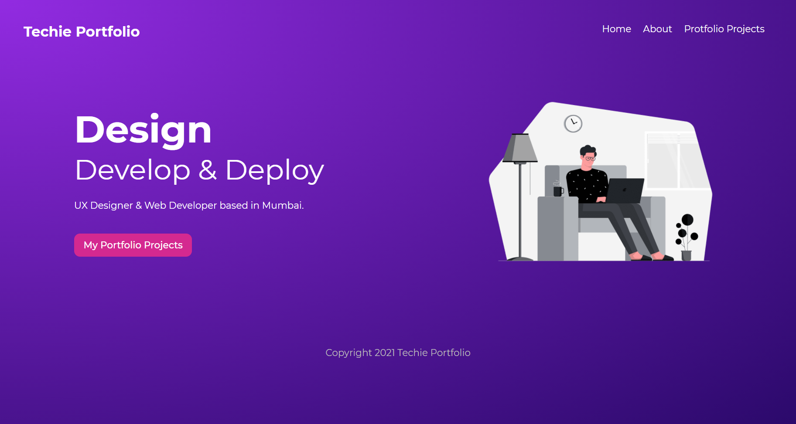

  

<h1 align="center">
  Techie Portfolio
</h1>

> A **McTechie** creation 👨‍🎨✨

### Tech Used

- [x] **[Gatsby](https://www.gatsbyjs.com/)**
- [x] **[GraphQL](https://graphql.org/)**
- [x] **[Netlify](https://www.netlify.com/)**

---

### Concepts Covered

- [x] Gatsby Config
- [x] Optimized Images and Metadata
- [x] Content Mesh (GraphQL)
- [x] Page Queries and useStaticQuery Hook
- [x] Gatsby Plugins
- [x] Gatsby Node (Multi Page Generation)

---

### Home Page

---

### Portfolio Projects Page

---

### Project Details Page

